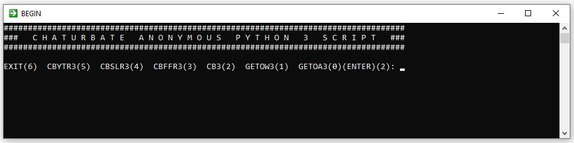
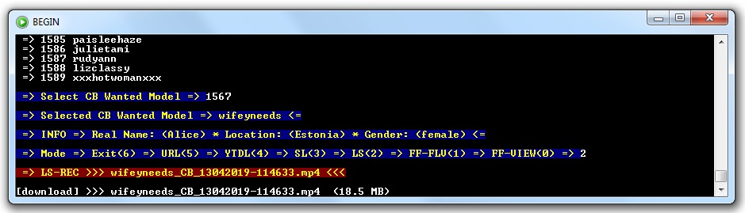

chaturbate-anonymous
====================
chaturbate-anonymous lets you follow and record your selected models shows on chaturbate.com or many black label sites.
We know that chaturbate is 'fast on the trigger' to ban somebody, and I have been convinced by this myself several times.
Often, we are banned from some models. For all these problems is the solution is this chaturbate-anonymous script.

What's new?
===========
In the version 1.0.8 the biggest news is that scripts now support Python3. I used the latest version 3.8.0 but I guess it will work on older Python3 versions. Python 2.7 will reach the end of its life on January 1st, 2020.
The former model list `CB_Model.txt` is now called `CB_Wanted.txt`. Now there is a possibility to get two new model lists using a `getModels` script (thanks to @keepgoingdev007). The first is a list of all Online models, and the second is a list of Wanted models that are currently online.
To properly use of all script options, you must use a `cba.bat` or `cba3.bat` batch script depending on the version of Python you have.
Also is added option to record a text file with a model URL link that can be of use.

Requirements
============
1. [Python 2.7.16](https://www.python.org/ftp/python/2.7.16/python-2.7.16.msi)
2. [Python 3.8.0a3](https://www.python.org/ftp/python/3.8.0/python-3.8.0a3.exe)
2. [Livestreamer](https://github.com/chrippa/livestreamer/releases) last version 1.12.2. It's best to install it individually in `C:/Livestreamer`
3. [Streamlink](https://github.com/streamlink/streamlink/releases) (tested with the last version 1.0.0) - better to install it independently in in `C:/Streamlink`
4. [ffmpeg & ffplay](https://ffmpeg.zeranoe.com/builds/) It is recommended to install the latest version.
5. [youtube-dl](https://github.com/rg3/youtube-dl) who must be somewere in the path, default location is `C:/Windows`

Setup
=====
1. Install requirements `pip install -r Requirements.txt` or one by one like this example `pip install beautifulsoup4==4.7.1`
2. Download and unpack the [code](https://codeload.github.com/horacio9a/chaturbate-anonymous/zip/master).
3. Open console and go into the directory where you unpacked the files (default is C:/-cba-py/)
4. `cba.bat` and `cba3.bat` can be anywhere (default is C:/Windows/)
5. Edit `config.ini` to your wish or accept default data.

Running & Output
================
Start `cba.bat` or `cba3.bat` batch script depending of the version of Python you have. It is recommended first make two new lists `CB_Online_All.txt` and `CB_Online_Wanted.txt` with options `0` and `1`.
Then select option 2 and start `cb.py` which is the most important script of all seven. You can now select the list you want to use (Options 0, 1 and 2).
When you choose the model you can start recording immediately. My recommendation is to use options 2 or 3 because only live `streamers` and `streamlinks` are recording without problems with the freeze of recording video.
You can use the option 0 to view the model with `ffplay` before recording. When you close the preview, it resembles the menu so it can be immediately recorded or interrupted script.
A new option number 5 (URL) is added to record a text file with a model link that can be of use.
However, if you want to record a certain model permanently (24/7), then you need to use options number 3 to 6 of batch script for start one of various dl programs for various remote scripts.
If you want to record more than one model at the same time then you need to start another copy of `cba.bat` or `cba3.bat` batch script.
Of course, you should always consider the size of free space on your disk, as there are plenty of models that use a 4K resolution.

New look of batch script `cba.bat`

Look after replacement of `progress.py` for `streamlink` and `livestreamer`

